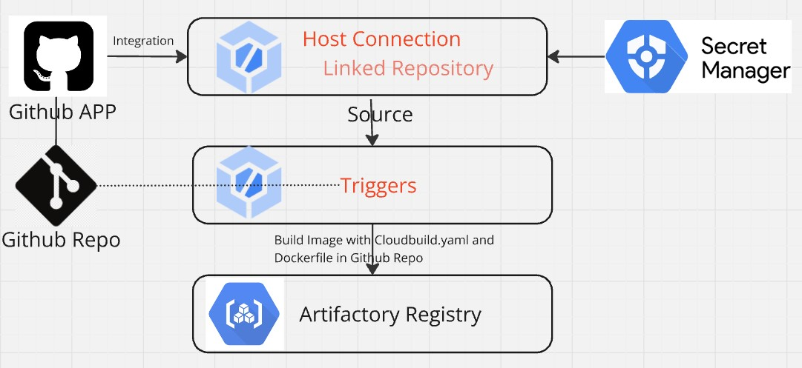

# CICD: manage cloudbuild with terraform
## About
This is a demo project for generating cloudbuild-related resources(Secret manager, Triggers, Integrations. etc) and build images from any repos. The whole infra is managed by terraform.


## Getting Started
### 1. set up environments
- Set up GCP credentials

    Run the following commands in terminal([Reference](https://registry.terraform.io/providers/hashicorp/google/latest/docs/guides/provider_reference.html#authentication)). It will generate a __application_default_credentials.json__ file or download __service account key__ that terraform will use from console.
```shell
    gcloud auth application-default login
```
- Generate a Personal Access Token (PAT) for Cloudbuild to authenticate with GitHub.

    1. Login to GitHub account and Navigate to "[Create new Token](https://github.com/settings/tokens/new)."
    2.  Select  **repo**.
    3. Click **Generate Token** and then copy the token.

- Add Cloudbuild APP in github

    Add a cloudbild App in github([Reference](https://github.com/marketplace/google-cloud-build)). We will need the app number for authentication between github and cloudbuild.

- Set variable value

    Create a __terraform.tfvars__ file and set variable values.

### 2. Deploy Cloudbuild related resources
- Install all providers
```shell
terraform init
```
- Plan and Apply
```shell
terraform plan
terraform apply
```

### 3. Build images

TF codes in this repo will create two cloudbuild triggers: dev-trigger uses Dockerfile in this github repo while dev-trigger-cross-repo can use Dockerfile in any repo that our PAT can access.
Everytime we push commits into the repo, cloudbuild will be triggered and build a image with the Dockerfile in this repo(Update repo link in __cloudbuild_cross_repo_access.yaml__ so cloudbuild can use Dockerfile in any repo) and push it to GCP Artifact Registry. We can also manually click __Run Trigger__ from gcp console.

### 4. TODO

Build a workflow and run multiple jobs with images built by cloudbuild.
<!-- BEGIN_TF_DOCS -->
## Requirements

| Name | Version |
|------|---------|
| <a name="requirement_terraform"></a> [terraform](#requirement\_terraform) | ~> 1.9 |
| <a name="requirement_google"></a> [google](#requirement\_google) | 5.44.0 |

## Providers

| Name | Version |
|------|---------|
| <a name="provider_google"></a> [google](#provider\_google) | 5.44.0 |

## Modules

No modules.

## Resources

| Name | Type |
|------|------|
| [google_artifact_registry_repository.my_repo](https://registry.terraform.io/providers/hashicorp/google/5.44.0/docs/resources/artifact_registry_repository) | resource |
| [google_cloudbuild_trigger.cross_repo_image_build](https://registry.terraform.io/providers/hashicorp/google/5.44.0/docs/resources/cloudbuild_trigger) | resource |
| [google_cloudbuild_trigger.image_build](https://registry.terraform.io/providers/hashicorp/google/5.44.0/docs/resources/cloudbuild_trigger) | resource |
| [google_cloudbuildv2_connection.my_connection](https://registry.terraform.io/providers/hashicorp/google/5.44.0/docs/resources/cloudbuildv2_connection) | resource |
| [google_cloudbuildv2_repository.my_repository](https://registry.terraform.io/providers/hashicorp/google/5.44.0/docs/resources/cloudbuildv2_repository) | resource |
| [google_secret_manager_secret.github_token_secret](https://registry.terraform.io/providers/hashicorp/google/5.44.0/docs/resources/secret_manager_secret) | resource |
| [google_secret_manager_secret_iam_policy.policy](https://registry.terraform.io/providers/hashicorp/google/5.44.0/docs/resources/secret_manager_secret_iam_policy) | resource |
| [google_secret_manager_secret_version.github_token_secret](https://registry.terraform.io/providers/hashicorp/google/5.44.0/docs/resources/secret_manager_secret_version) | resource |
| [google_iam_policy.serviceagent_secretAccessor](https://registry.terraform.io/providers/hashicorp/google/5.44.0/docs/data-sources/iam_policy) | data source |

## Inputs

| Name | Description | Type | Default | Required |
|------|-------------|------|---------|:--------:|
| <a name="input_artifact_registry"></a> [artifact\_registry](#input\_artifact\_registry) | Artifact registry name(This resource will be created by tf) | `string` | n/a | yes |
| <a name="input_cloudbuild_filename"></a> [cloudbuild\_filename](#input\_cloudbuild\_filename) | Cloudbuild yaml filename in your github repo that you want cloudbuild triggers to use | `string` | `"cloudbuild_image.yaml"` | no |
| <a name="input_cloudbuild_filename_cross_repo"></a> [cloudbuild\_filename\_cross\_repo](#input\_cloudbuild\_filename\_cross\_repo) | Cloudbuild yaml filename in your github repo that you want cloudbuild triggers to use | `string` | `"cloudbuild_cross_repo_access.yaml"` | no |
| <a name="input_cloudbuild_trigger_name"></a> [cloudbuild\_trigger\_name](#input\_cloudbuild\_trigger\_name) | Cloudbuild trigger name(This resource will be created by tf) | `string` | n/a | yes |
| <a name="input_cloudbuild_trigger_sa"></a> [cloudbuild\_trigger\_sa](#input\_cloudbuild\_trigger\_sa) | The service account used by Cloudbuild, Compute default service account (******-compute@developer.gserviceaccount.com) can be used here. | `string` | n/a | yes |
| <a name="input_github_app_installation_id"></a> [github\_app\_installation\_id](#input\_github\_app\_installation\_id) | Github Cloudbuild App id | `string` | n/a | yes |
| <a name="input_github_cloudbuild_repo_config"></a> [github\_cloudbuild\_repo\_config](#input\_github\_cloudbuild\_repo\_config) | Config for github repo used by cloudbuild. | `map(any)` | <pre>{<br/>  "branch": "master",<br/>  "repo": "cloudbuild-with-terraform",<br/>  "url": "https://github.com/jianxing31/cloudbuild-with-terraform.git"<br/>}</pre> | no |
| <a name="input_github_pat_secret"></a> [github\_pat\_secret](#input\_github\_pat\_secret) | Github pat token | `string` | n/a | yes |
| <a name="input_google_credentials_file"></a> [google\_credentials\_file](#input\_google\_credentials\_file) | GCP Credential file path | `string` | n/a | yes |
| <a name="input_project"></a> [project](#input\_project) | GCP Project name | `string` | n/a | yes |
| <a name="input_region"></a> [region](#input\_region) | GCP Resource Region | `string` | n/a | yes |
| <a name="input_sa_serviceagent_secretAccessor"></a> [sa\_serviceagent\_secretAccessor](#input\_sa\_serviceagent\_secretAccessor) | Service account used by cloudbuild for accessing secret manager(e.g. service-*****@gcp-sa-cloudbuild.iam.gserviceaccount.com). | `string` | n/a | yes |
| <a name="input_secret_name"></a> [secret\_name](#input\_secret\_name) | GCP secret manager name(This resource will be created by tf) | `string` | n/a | yes |

## Outputs

No outputs.
<!-- END_TF_DOCS -->
